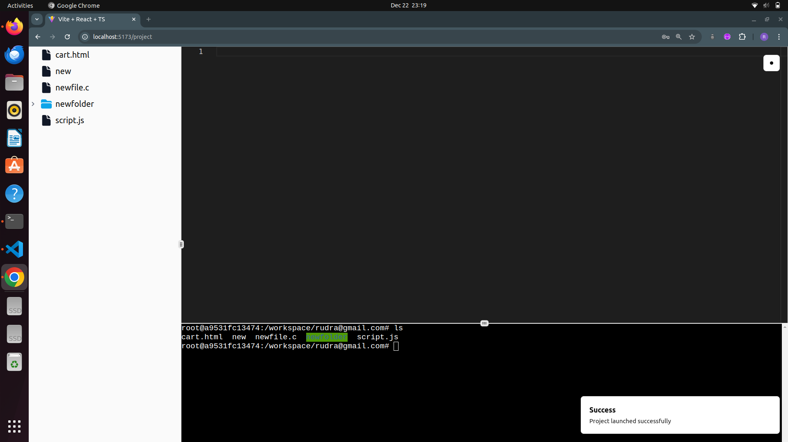

# Web-Based Code Editor  

A sleek and interactive web-based code editor that supports multiple languages, real-time collaboration, and syntax highlighting.  

## Features  

- **Multi-language support**: Code in JavaScript, Python, C++, and more.  
- **Syntax highlighting**: Easy-to-read code with color-coded syntax.  
- **Docker integration**: Run and test code in isolated environments.  

  
